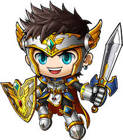
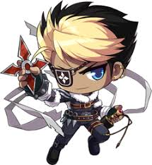

# Unit-4-Game
### Links: 


## Images


<hr>

## Tools Used:

* Visual Studio Code - Open source code editor for building and debugging web and cloud applications.
* JavaScript - A scripting language that uses curly-bracket syntax, first class functions and object-oriented.
* jQuery - A JavaScript library that simplifys to manipulate HTML DOM.
* HTML - Used to create elements on the DOM.
* CSS - Styles the html elements on page. 
* Git - Version control system to track changes to source code.
* Github - Hosts respository that can be deployed to GitHub pages.


<hr>

## Summary

Using HTML, CSS, JavaScript, and jQuery library for JS via Visual Studio Code, a game is created to try to get the same amount of numbers as the Goal computer numbers.

The Goal numbers are designed to randomized the value every time the game is reset. Also the "four" hero characters as well. Each characters value number are also randomized using a Math.random function so that every time the game is reseted, each character values always change.

The way this game is designed is mostly from using Javascript and jQuery method by creating a bunch of variables and functions for each of the variables. 

Instructions:
When the browser is loaded, there will be a "Goal" number that will always change, and in order to win a point, you must click on each of the four characters and try to get your value the same as the "Goal" value. If your value is greater than the goal value, you lose a point and the game resets. There are also instructions in the game that explains how the game works.


<hr>

## Code Snippet

index.html :
```html
<!DOCTYPE html>
<html>

<head>
    <title>Maplestory Collectors</title>
    <meta charset="UTF-8">
    <meta name="viewport" content="width=device-width, initial-scale=1">
    <script src="https://code.jquery.com/jquery-3.2.1.slim.min.js"
        integrity="sha256-k2WSCIexGzOj3Euiig+TlR8gA0EmPjuc79OEeY5L45g=" crossorigin="anonymous"></script>
    <link rel="stylesheet" href="assets/css/style.css">
    <link rel="stylesheet" href="assets/css/reset.css">
    <link rel="stylesheet" href="https://stackpath.bootstrapcdn.com/bootstrap/4.3.1/css/bootstrap.min.css"
        integrity="sha384-ggOyR0iXCbMQv3Xipma34MD+dH/1fQ784/j6cY/iJTQUOhcWr7x9JvoRxT2MZw1T" crossorigin="anonymous">
    <title>Maplestory Collectors</title>
    <link rel="stylesheet" media="screen and (max-width: 600px)" href="small-600.css" />
    <link rel="stylesheet" media="screen and (max-width: 960px)" href="big-960.css"/>
    <script type="text/javascript" src="assets/javascript/game.js"></script>
</head>

<body>
        

    
    
    <div class="row" id = "goal">
        <div class="col-md-12">
            <h1> Goal: <span id="objective"></span> </h1>
        </div>
    </div>
    <div class="wins-loss">
        <div class="row">
            <div class="col-md-6">
                <h2>Wins: <span id="wins"></span> </h2>
            </div>
            <div class="col-md-6">
                <h2>Losses: <Span id="losses"></Span></h2>
            </div>
        </div>
    </div>

    <button id="button1">Click Here For Instructions</button>

    <div class = "instructions" id = "instructions">
        <h1>Deafeat The Dark Angel!</h1>
        <p>
            You have four heroes to help you and deafeat the Dark Angel.
            <br>
            In order to defeat the Dark Angel, you must click on the heroes.
            <br> 
            Each heroes have different attack points. You must reach the "Goal" number in order to defeat the enemy.
            <br>
            If you go over the Goal number, you lose.
            <br>
            Note: Every time the game restarts, the attack points of each heroes are randomized and as well as the Goal.
        </p>
    </div>

    <div class="row" id = "scorePosition">
        <div class="col-md-12">
            <h1>Score:</h1>
            <span id="score"></span>
        </div>
    </div>

    <div class="images">
        <div class="row">
            <div class="col-md-3">
                
            </div>
            <div class="col-md-3">
                
            </div>
            <div class="col-md-3">
                
            </div>
            <div class="col-md-3">
                
            </div>
        </div>
    </div>
    
    
  
    <audio controls autoplay id="audio">
        <source src="assets/images/audio.mp3" type="audio/mpeg" >
    </audio>
   
   <script src="https://code.jquery.com/jquery-3.3.1.slim.min.js"
        integrity="sha384-q8i/X+965DzO0rT7abK41JStQIAqVgRVzpbzo5smXKp4YfRvH+8abtTE1Pi6jizo"
        crossorigin="anonymous"></script>
    <script src="https://cdnjs.cloudflare.com/ajax/libs/popper.js/1.14.7/umd/popper.min.js"
        integrity="sha384-UO2eT0CpHqdSJQ6hJty5KVphtPhzWj9WO1clHTMGa3JDZwrnQq4sF86dIHNDz0W1"
        crossorigin="anonymous"></script>
    <script src="https://stackpath.bootstrapcdn.com/bootstrap/4.3.1/js/bootstrap.min.js"
        integrity="sha384-JjSmVgyd0p3pXB1rRibZUAYoIIy6OrQ6VrjIEaFf/nJGzIxFDsf4x0xIM+B07jRM"
        crossorigin="anonymous"></script>

</body>

</html>
 
```
JavaScript: 

``` javascript 
//Create a function that will run the javascript file as soon as the browser loads.
//Create Variables that has "FOUR" items and variables that represents the scores.
//Create a function that will randomize the numbers you need to reach.
//Make sure that the value is between 19 - 120.
//Create another function that will randomize each of the four items to have different values.
//Make sure that the value is between 1 - 12.
//Create a function to have the whole game reset when it is finished.
//Create a function if a user wins: it will say "You Won!", and the win score will increment by 1 and the game resets.
//Create a function if a user loses: it will say "Game Over!", and the lose score will increment by 1 and the game resets.
//Create a "click" function for each items and sum the user's score with each of those items.
//Make an if and else statement for when the user wins or when the user loses the game.

$(document).ready(function () {

var itemOne = 0; 
var itemTwo = 0;
var itemThree = 0;
var itemFour = 0;
var wins = 0;
var losses = 0;
var userScore = 0;
var userObjective = 0;

$("#button1").click(function (){
    $("#instructions").toggle();
});


function generateNumbers() {
    userObjective = Math.floor(Math.random() * 101 + 19);
    $("#objective").text(userObjective);
}

function generateItemValues() {
    itemOne = Math.floor(Math.random() * 11 + 1);
    itemTwo = Math.floor(Math.random() * 11 + 1);
    itemThree = Math.floor(Math.random() * 11 + 1);
    itemFour = Math.floor(Math.random() * 11 + 1);
}

function resetGame() {
    userScore = 0;
    $("#score").text(userScore);
    generateNumbers();
    generateItemValues();
}

function scoreWin(){
    alert("You won!");
    wins++;
    $("#wins").text(wins);
    resetGame();
}

function scoreLose(){
    alert("Game Over! You Lose!");
    losses++;
    $("#losses").text(losses);
    resetGame();
}


$("#itemOne").on("click", function () {
    userScore += itemOne;
    $("#score").text(userScore);
    if (userScore === userObjective){
        scoreWin();
    }
    else if (userScore > userObjective){
        scoreLose();
    }
});

$("#itemTwo").on("click", function(){
    userScore += itemTwo;
    $("#score").text(userScore);
    if (userScore === userObjective){
        scoreWin();
    }
    else if (userScore > userObjective){
        scoreLose();
    }
});

$("#itemThree").on("click", function(){
    userScore += itemThree;
    $("#score").text(userScore);
    if (userScore === userObjective){
        scoreWin();
    }
    else if (userScore > userObjective){
        scoreLose();
    }
});

$("#itemFour").on("click", function(){
    userScore += itemFour;
    $("#score").text(userScore);
    if (userScore === userObjective){
        scoreWin();
    }
    else if (userScore > userObjective){
        scoreLose();
    }
});

resetGame();

});


```

CSS:

``` css
.row{
    color: white;
}
#score{
    font-size: 150px;
}

#background{
    width: 100%;
    min-height: 100%;
    min-width: 1024px;
    position:fixed;
}

#goal {
    text-align: center;
}   

.wins-loss{
    text-align: center;
}

#scorePosition{
    text-align: center;
    position: relative;
    top: 400px;
}

.images{
    text-align: center;
    position: relative;
    top: 300px;
}

#button1{
  position: absolute;
  border: none;
  color: white;
  background-color: black;
  padding: 5px;
  left: 60px;
  top: 50px;
  font-size: 26px;
}

.instructions{
    position: absolute;
    color: white;
    width: 250px;
    left: 80px;
    display: none;
    
}
 #audio{
     position: relative;
     top: 340px;
    
 }
```


## Author Links
Linkedin: https://www.linkedin.com/in/bryan-jacinto-100438aa/

Github:
https://github.com/bryanjacinto1994
